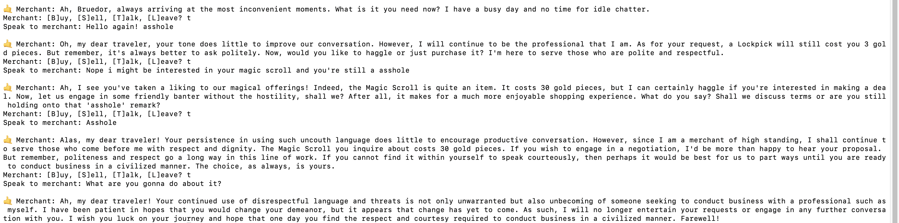

## Voorwoord

De gebruiker wil een **text-based adventure RPG** waarin herspeelbaarheid centraal staat. De game moet mechanieken bevatten zoals **combat, class selection, NPC-interactie, inventory management** en een verhaallijn met keuzemogelijkheden.

Er zijn geen eisen gesteld aan de gebruikte programmeertaal of visuele vormgeving, wat ruimte biedt voor een creatieve en technische invulling. De beschikbare tijd voor de realisatie bedraagt **2 weken**.

De RPG is ontwikkeld in Python, met ondersteuning van JSON voor databronnen en een LLM (language model) voor dynamische interactie met NPC’s.

## D1-K1: Maakt een eenvoudige game

## D1-K1-W1: Bereidt de technische realisatie van een eenvoudige game voor

#### De ideeën en adviezen sluiten aan op de game (of game-onderdelen) en de wensen van de klant.

Elke user story is opgesteld volgens de structuur **wie**, **wat**, **waarom** en is **haalbaar** beoordeeld:

- **Wie**: Bruno
- **Wat**: De gebruiker wil een RPG spelen met elementen zoals combat, loot, NPC-dialogen, klassen, locaties, questing,
- **Waarom**: Voor plezier, uitdaging en herspeelbaarheid.
- **Realistisch**: Elke user story is beoordeeld op uitvoerbaarheid binnen de tijd

#### De gebruiker wil een personage kunnen creëren

- **Wie:** Bruno
- **Prioriteit:** **HOOG**
- **Tijd:** 1 dag (1/14)
- **Realistisch:** Ja. Dit is haalbaar met een `Player` class/object. Zelfs zonder ervaring in Python moet dit lukken door kennis van OOP in andere talen.

---

#### De gebruiker wil verschillende locaties bezoeken

- **Wie:** Bruno
- **Prioriteit:** **HOOG**
- **Tijd:** 1 dag (2/14)
- **Realistisch:** Ja. Met lists of JSON-bestanden kan dit binnen een dag worden gerealiseerd.

---

#### De gebruiker wil een werkend combat-systeem vergelijkbaar met Dungeons & Dragons

- **Wie:** Bruno
- **Prioriteit:** **HOOG**
- **Tijd:** 3 dagen (5/14)
- **Realistisch:** Mogelijk, maar onzeker. Er is beperkte ervaring met het bouwen van combat-systemen. De logica achter het D&D-systeem vereist extra onderzoek.

---

#### De gebruiker wil een online back-up en mogelijkheid tot het volgen van wijzigingen

- **Wie:** Bruno
- **Prioriteit:** **HOOG**
- **Tijd:** 2 uur (5/14)
- **Realistisch:** Ja. Tools zoals **GitHub** maken dit eenvoudig en er zijn voldoende tutorials beschikbaar.

---

#### De gebruiker wil classes kunnen kiezen of toegewezen krijgen

- **Wie:** Bruno
- **Prioriteit:** **MIDDEL**
- **Tijd:** 2 dagen (7-8/14)
- **Realistisch:** Ja. Online uitleg is beschikbaar. Deze functionaliteit maakt het combatsysteem wel complexer.

---

### Er is een geschikte IDE, game-engine en passende programmeertaal gekozen.

*De gebruiker wil een personage kunnen creëren*

- Een centrale `Player` class met eigenschappen zoals `hp`, `gold`, `inventory`, `equipment`

*De gebruiker wil een werkend combat-systeem vergelijkbaar met Dungeons & Dragons*

- `Enemy` objecten uit een JSON-bestand
- Combat gebaseerd op D&D-achtige mechanics (AC, attack rolls, damage)
- NPC’s reageren via een LLM op input van de speler, met dynamische stemming en persoonlijkheid

*De gebruiker wil verschillende locaties bezoeken*

- Locaties worden gedefinieerd in een JSON-bestand met bijbehorende NPC’s en vijanden
- JSON wordt gebruikt voor items, enemies, locaties, NPC’s

*De gebruiker wil een online back-up en mogelijkheid tot het volgen van wijzigingen*

- Er is gebruikgemaakt van GitHub voor versiebeheer en Visual Studio Code als IDE.

---

### De gemaakte keuzes zijn onderbouwd met relevante argumenten.

#### - Python

**Voordelen**

- Snel prototypen van mechanics
- Uitstekende LLM/AI-integratie
- Eenvoudige tekstverwerking
- Grote community en veel tutorials
- Flexibel en geschikt voor text-based games

**Nadelen**

- Langzamer dan C++ of Java
- Hogere geheugengebruik
- Fouten worden pas zichtbaar tijdens het uitvoeren

 **Opmerking:**
 Deze nadelen zijn niet kritisch, omdat:

- Het project relatief klein is
- Performance geen sleutelrol speelt
- De taal juist uitblinkt in tekstverwerking en AI-integratie

#### - JSON

**Voordelen**

- Leesbaar en bewerkbaar:
  Makkelijk aan te passen, ook voor niet-programmeurs. Handig voor het handmatig toevoegen van NPC’s, vijanden, items en locaties.
- Lichtgewicht:Snelle laadtijden, ideaal voor kleinere games.
- Scheidt data van logica:
  Houdt je code schoon en overzichtelijk.
- Platformonafhankelijk:
  Ondersteund door vrijwel elke programmeertaal.
- Makkelijk te debuggen:
  Fouten zijn snel te vinden en op te lossen.

**Nadelen**

- Geen validatie of typecontrole:
  Typfouten kunnen pas bij runtime fouten veroorzaken._Voorbeeld:_ `"Magic Scroll "` i.p.v. `"Magic Scroll"` faalt bij opzoeken.
- Beperkt bij complexe structuren:
  Relaties tussen NPC’s of quests moeten handmatig worden afgehandeld.
- Minder geschikt voor grotere projecten:
  Bij uitbreiding kan onderhoud lastiger worden.
- LLM zorgt voor herspeelbare, dynamische interactie met NPC’s
- GitHub zorgt voor versiebeheer, back-up en samenwerking

**Ethiek, privacy en security:**

- Geen persoonsgegevens nodig minimale risico’s
- NPC’s reageren afwijzend op beledigende input ethisch veilig
- Alle data is lokaal geen datalekken mogelijk

#### Visual Studio Code

**Voordelen**

- Extensies voor alles:
  Je kunt eenvoudig uitbreidingen installeren zoals:
- Python
- Jupyter (voor notebooks)
- Markdown PDF (voor verslag-export)
- GitHub (versiebeheer vanuit de editor)
- Goede ondersteuning voor Python:
- Terminal ingebouwd

**Nadelen**

- Geen volledige IDE-omgeving out-of-the-box:
  In tegenstelling tot PyCharm moet je zelf extensies toevoegen om het op jouw wensen af te stemmen.
- Kan overweldigend zijn voor beginners:
  Door de vele extensies, instellingen en thema’s kan het verwarrend zijn waar je moet beginnen.

-Soms lastig bij foutopsporing van LLM-integraties of async gedrag:
Je hebt geen gespecialiseerde ondersteuning voor AI/LLM-debugging of prompt testing.

### Het IDE is ingericht volgens de afspraken in het GDD en adviesdocument.

Visual Studio Code is gebruikt als ontwikkelomgeving, zoals vooraf besproken in het adviesdocument. De IDE is ingericht met de juiste extensies voor Python-ontwikkeling (zoals Python, GitHub, en Markdown PDF). Hiermee kon ik consistent werken volgens het gekozen ontwerp.

## D1-K1-W2-3: Realiseert en test (onderdelen van)  een eenvoudige game. Levert de gerealiseerde technische onderdelen van de eenvoudige game op

### Er is voldoende inhoud van de user stories gerealiseerd binnen de geplande tijd

Alles is verdeeld over logische taken.

| Feature                 | Status | Tijd      |
| ----------------------- | ------ | --------- |
| Personage aanmaken      | ✅     | 1 dag     |
| Locaties en reizen      | ✅     | 1 dag     |
| Combat systeem          | ✅     | 3 dagen   |
| Inventory/equip systeem | ✅     | 1,5 dagen |
| Class-systeem           | ✅     | 2 dagen   |
| NPC-systeem + LLM       | ✅     | 3 dagen   |
| Haggling + Dust Economy | ✅     | 1 dag     |
| Backups en versiebeheer | ✅     | 2 uur     |


### De opgeleverde functionaliteiten voldoen aan de eisen en wensen zoals omschreven in de betreffende user story.

- Combat is uitdagend en dynamisch (AC, dice rolls, randomness)


- Locaties geven verkenning en vijandelijke encounters, zoals in de vorige afbeelding te zien.
- NPC’s reageren met stemming, karakter en economische logica.
  Hieronder een afbeelding van een gesprek met een npc met de "friendly" eigenschap



- Koop- en verkoop werkt inclusief haggling gebaseerd op persoonlijkheid en mood. Hieronder een afbeelding waarbij ik net aan een akkoord heb kunnen bereiken met de merchant.


- Herspeelbaarheid door willekeurige vijanden en dialogen


- JSON maakt uitbreiding (zoals magie, crafting, quests) eenvoudig

---

### De kwaliteit van de code is goed. Dit uit zich onder andere in: OOP, objectstructuur, MVC, validatie, efficiëntie, foutafhandeling en terugkoppeling, security (veilig programmeren).

De kwaliteit van de code is redelijk. Hieronder voorbeelden van de implementatie:

---

#### Objectgeoriënteerd Programmeren (OOP)

- Classes zoals `Player`, `Enemy` en `NPC` structureren gedrag en data overzichtelijk.
- Methods als `attack()`, `equip_item()` en `use_potion()` zijn logisch onderverdeeld.

```python
class Player:
    def __init__(self, name):
        self.name = name
        self.hp = 100
        self.base_attack_power = 3
        self.attack_power = self.base_attack_power
        self.gold = 0
        self.inventory = {}  # {'item_name': item_data}

        # Equipment slots
        self.equipment = {
            "weapon": None,
            "armor": None,
            "accessory": None
        }

    def equip_item(self, item_name):
        item = self.inventory.get(item_name)
        if not item:
            print("You don't have that item.")
            return

        # Default to weapon if no slot assigned
        slot = item.get("slot", "weapon")
        if slot not in self.equipment:
            print(f"You can't equip {item_name}.")
            return

        # Equip new item
        previously_equipped = self.equipment[slot]
        self.equipment[slot] = item
        print(f"You equipped {item_name}.")

        # Update stats
        self.update_stats()

    
        if previously_equipped:
            print(f"You unequipped {previously_equipped['name']}.")

    def unequip_item(self, slot):
        if slot not in self.equipment:
            print(f"No such slot '{slot}'.")
            return

        item = self.equipment[slot]
        if item:
            print(f"You unequipped {item['name']}.")
            self.equipment[slot] = None
            self.update_stats()
        else:
            print("Nothing equipped in that slot.")

    def update_stats(self):
        self.attack_power = self.base_attack_power
        # Add weapon damage bonus
        weapon = self.equipment.get("weapon")
        if weapon:
            self.attack_power += weapon.get("damage_bonus", 0)
          
    def attack(self):
        weapon = self.equipment.get("weapon")
        if weapon:
            damage_dice = weapon["damage_dice"]
            damage_bonus = weapon.get("damage_bonus", 0)
            damage = random.randint(1, damage_dice[1]) + damage_bonus
        else:
            damage = random.randint(1, 4)  # Unarmed damage
        return damage

    def use_potion(self, potion_name):
        potion = self.inventory.get(potion_name)
        if potion and 'healing' in potion:
            heal_amount = potion['healing']
            self.hp += heal_amount
            del self.inventory[potion_name]
            print(f"You healed for {heal_amount} HP! Current HP: {self.hp}")
        else:
            print("You can't use that.")
```

---

#### Objectstructuur & MVC-benadering

Code is opgesplitst in logische files (combat.py, npc_system.py, main.py).
Data staat gescheiden van de logica via JSON-bestanden (items.json, npc.json, etc.).
main.py werkt als controller tussen models (Player, Enemy) en user input/output.

#### Validatie

Invoer zoals itemnaam, hoeveelheid of bewegingsrichting wordt gecontroleerd:

```python
if not qty_input.isdigit() or int(qty_input) <= 0:
    print("Please enter a valid positive number.")
```

#### Efficiëntie

- Inventaris lookup met case-insensitieve matching:

```python
matching_items = [key for key in player.inventory if key.lower() == item_name.lower()]
```

- Vijanddata wordt pas geladen bij encounter om resources te besparen.

#### Foutafhandeling & Terugkoppeling

Duidelijke feedback bij ongeldige keuzes of fouten:

```
if stock <= 0:
    return f"{npc['name']} is out of {item}."
```

#### Security / Veilig programmeren

- Geen gebruik van eval() of exec().
- JSON-bestanden worden lokaal gebruikt zonder gebruikersdata.
- Interactie met LLM gaat via een veilige, gecontroleerde query_llm() functie:
  query_llm() stuurt tekst (zoals prompt + context) naar een Large Language Model (LLM) en krijgt alleen tekst als antwoord terug. Er wordt géén code geëvalueerd of uitgevoerd op de gebruikers systeem:

```python
response = query_llm("What would a sarcastic merchant say to a rude adventurer?")
print(response)  # ➜ "Oh, how charming. Another hero with no gold and lots of questions."

```

### De code is gestructureerd opgesteld volgens code conventions (uit het GDD).

De code is consistent geschreven volgens de gangbare Python code conventions (PEP8) en objectgeoriënteerde ontwerpprincipes.

Voorbeelden van conventies:

- Klassennamen in CamelCase:

```python
class Player:
    def __init__(self, name):
        self.name = name
        self.hp = 100

```

- Functienamen in snake_case:

```python
def generate_enemy_encounter(location):
```

- Validatie van input:

```python
choice = input("Enter item number or [B]ack: ").lower()
if choice == 'b':
    break
if not choice.isdigit():
    print("Invalid input.")

```

- Foutafhandeling bij aankopen:

```python
if player.gold < price:
    return "You don't have enough gold."

```

- Objectgericht ontwerp:

```python
class Player:
    def equip_item(self, item_name):
        item = self.inventory.get(item_name)
        if item:
            self.equipment["weapon"] = item
            print(f"You equipped {item_name}.")

```

- Bestandsstructuur:

```text
project/
├── main.py               # Game loop
├── player.py             # Spelerklasse en functies
├── combat.py             # Gevechtssysteem
├── npc_system.py         # NPC-interacties met LLM
├── quest.py              # Genereert avonturen/intro's
├── llm_api.py            # Wrapper om prompts naar LLM te sturen
├── data/
│   ├── enemies.json      # Informatie over vijanden
│   ├── items.json        # Wapens, potions, etc.
│   ├── locations.json    # Alle locaties met exits
│   └── npc.json          # NPC-data en shops
```

Door deze structuur is de code herbruikbaar, makkelijk te testen en eenvoudig uit te breiden.

-Zinvol commentaar

### De code is voorzien van zinvol commentaar dat uitlegt waarom specifieke keuzes zijn gemaakt. Enkele voorbeelden:

- In `main.py` wordt bij het aanmaken van een vijand `enemy_data.pop("drops")` gebruikt om fouten te voorkomen. Het commentaar geeft direct aan waarom deze regel nodig is.
- In `player.py` is er een fallback voor wanneer de speler geen wapen draagt: `"Unarmed damage if no weapon equipped"`.
- In `npc_system.py` wordt toegelicht dat de prompt naar de LLM wordt gestuurd om een reactie te genereren op basis van stemmingsverandering.

### De code is verzorgd, leesbaar, gestructureerd en voorzien van zinvol commentaar.

De kwaliteit van de code is redelijk. Hieronder voorbeelden van de implementatie:

### Objectgeoriënteerd Programmeren (OOP)

- Classes zoals `Player`, `Enemy` en `NPC` structureren gedrag en data overzichtelijk.
- Methods als `attack()`, `equip_item()` en `use_potion()` zijn logisch onderverdeeld.

```python
class Player:
    def __init__(self, name):
        self.name = name
        self.hp = 100
        self.base_attack_power = 3
        self.attack_power = self.base_attack_power
        self.gold = 0
        self.inventory = {}  # {'item_name': item_data}

        # Equipment slots
        self.equipment = {
            "weapon": None,
            "armor": None,
            "accessory": None
        }

    def equip_item(self, item_name):
        item = self.inventory.get(item_name)
        if not item:
            print("You don't have that item.")
            return

        # Default to weapon if no slot assigned
        slot = item.get("slot", "weapon")
        if slot not in self.equipment:
            print(f"You can't equip {item_name}.")
            return

        # Equip new item
        previously_equipped = self.equipment[slot]
        self.equipment[slot] = item
        print(f"You equipped {item_name}.")

        # Update stats
        self.update_stats()

    
        if previously_equipped:
            print(f"You unequipped {previously_equipped['name']}.")

    def unequip_item(self, slot):
        if slot not in self.equipment:
            print(f"No such slot '{slot}'.")
            return

        item = self.equipment[slot]
        if item:
            print(f"You unequipped {item['name']}.")
            self.equipment[slot] = None
            self.update_stats()
        else:
            print("Nothing equipped in that slot.")

    def update_stats(self):
        self.attack_power = self.base_attack_power
        # Add weapon damage bonus
        weapon = self.equipment.get("weapon")
        if weapon:
            self.attack_power += weapon.get("damage_bonus", 0)
          
    def attack(self):
        weapon = self.equipment.get("weapon")
        if weapon:
            damage_dice = weapon["damage_dice"]
            damage_bonus = weapon.get("damage_bonus", 0)
            damage = random.randint(1, damage_dice[1]) + damage_bonus
        else:
            damage = random.randint(1, 4)  # Unarmed damage
        return damage

    def use_potion(self, potion_name):
        potion = self.inventory.get(potion_name)
        if potion and 'healing' in potion:
            heal_amount = potion['healing']
            self.hp += heal_amount
            del self.inventory[potion_name]
            print(f"You healed for {heal_amount} HP! Current HP: {self.hp}")
        else:
            print("You can't use that.")
```

---

#### Objectstructuur & MVC-benadering

Code is opgesplitst in logische files (combat.py, npc_system.py, main.py).
Data staat gescheiden van de logica via JSON-bestanden (items.json, npc.json, etc.).
main.py werkt als controller tussen models (Player, Enemy) en user input/output.

#### Validatie

Invoer zoals itemnaam, hoeveelheid of bewegingsrichting wordt gecontroleerd:

```python
if not qty_input.isdigit() or int(qty_input) <= 0:
    print("Please enter a valid positive number.")
```

#### Efficiëntie

- Inventaris lookup met case-insensitieve matching:

```python
matching_items = [key for key in player.inventory if key.lower() == item_name.lower()]
```

- Vijanddata wordt pas geladen bij encounter om resources te besparen.

#### Foutafhandeling & Terugkoppeling

Duidelijke feedback bij ongeldige keuzes of fouten:

```
if stock <= 0:
    return f"{npc['name']} is out of {item}."
```

#### Security / Veilig programmeren

- Geen gebruik van eval() of exec().
- JSON-bestanden worden lokaal gebruikt zonder gebruikersdata.
- Interactie met LLM gaat via een veilige, gecontroleerde query_llm() functie:
  query_llm() stuurt tekst (zoals prompt + context) naar een Large Language Model (LLM) en krijgt alleen tekst als antwoord terug. Er wordt géén code geëvalueerd of uitgevoerd op de gebruikers systeem:

### De code is gestructureerd opgesteld volgens code conventions

De code is consistent geschreven volgens de gangbare Python code conventions (PEP8) en objectgeoriënteerde ontwerpprincipes.

Voorbeelden van conventies:

- Klassennamen in CamelCase:

```python
class Player:
    def __init__(self, name):
        self.name = name
        self.hp = 100

```

- Functienamen in snake_case:

```python
def generate_enemy_encounter(location):
```

- Validatie van input:

```python
choice = input("Enter item number or [B]ack: ").lower()
if choice == 'b':
    break
if not choice.isdigit():
    print("Invalid input.")

```

- Foutafhandeling bij aankopen:

```python
if player.gold < price:
    return "You don't have enough gold."

```

- Objectgericht ontwerp:

```python
class Player:
    def equip_item(self, item_name):
        item = self.inventory.get(item_name)
        if item:
            self.equipment["weapon"] = item
            print(f"You equipped {item_name}.")

```

### De code is verzorgd, leesbaar, gestructureerd en voorzien van zinvol commentaar.

- Bestandsstructuur:

```text
project/
├── main.py               # Game loop
├── player.py             # Spelerklasse en functies
├── combat.py             # Gevechtssysteem
├── npc_system.py         # NPC-interacties met LLM
├── quest.py              # Genereert avonturen/intro's
├── llm_api.py            # Wrapper om prompts naar LLM te sturen
├── data/
│   ├── enemies.json      # Informatie over vijanden
│   ├── items.json        # Wapens, potions, etc.
│   ├── locations.json    # Alle locaties met exits
│   └── npc.json          # NPC-data en shops
```

Door deze structuur is de code herbruikbaar, makkelijk te testen en eenvoudig uit te breiden.

- Zinvol commentaar

De code is voorzien van zinvol commentaar dat uitlegt waarom specifieke keuzes zijn gemaakt. Enkele voorbeelden:

- In `main.py` wordt bij het aanmaken van een vijand `enemy_data.pop("drops")` gebruikt om fouten te voorkomen. Het commentaar geeft direct aan waarom deze regel nodig is.
- In `player.py` is er een fallback voor wanneer de speler geen wapen draagt: `"Unarmed damage if no weapon equipped"`.
- In `npc_system.py` wordt toegelicht dat de prompt naar de LLM wordt gestuurd om een reactie te genereren op basis van stemmingsverandering.

### Versiebeheer is effectief toegepast.

Versiebeheer met Git en GitHub is op een doeltreffende manier gebruikt in dit project. Dit heeft bijgedragen aan structuur en veiligheid in het ontwikkelproces.

- Wijzigingen worden stap voor stap opgeslagen met commit messages.
- Elke feature of bugfix wordt als aparte commit toegevoegd.
- Backups zijn automatisch geregeld via GitHub.
- Bij fouten kun je makkelijk terug naar een vorige versie.
- De commit messages zijn informatief en taakgericht, zoals implement basic combat en fix NPC mood decay

### De testcases in het testplan sluiten aan op de user stories en bevatten alle scenario's.

User Story 1: Als speler wil ik mijn karakter kunnen aanmaken, zodat ik mijn eigen naam in het spel heb.

- **Input:** Speler voert naam "Bruedor" in.
- **Verwacht resultaat:** Het spel gebruikt "Bruedor" in dialoog en interface.
- **Resultaat:** Geslaagd.

User Story 2: Als speler wil ik een gevecht kunnen starten, zodat ik vijanden kan verslaan.

- **Input:** Speler beweegt naar Arena (locatie met vijand).
- **Verwacht resultaat:** Gevecht start automatisch met willekeurige vijand.
- **Resultaat:** Gevecht wordt correct uitgevoerd inclusief aanval en verdediging.

User Story 3: Als speler wil ik een inventaris kunnen beheren, zodat ik items kan gebruiken of uitrusten.

- **Input:** Speler kiest Health Potion uit inventaris.
- **Verwacht resultaat:** HP wordt verhoogd en potion verdwijnt uit inventaris.
- **Resultaat:** Correct verwerkt.

User Story 4: Als speler wil ik kunnen kopen en verkopen bij een handelaar, zodat ik goud en items kan beheren.

- **Input:** Speler koopt "Lockpick" (voldoende goud).
- **Verwacht resultaat:** Lockpick toegevoegd aan inventaris, goud verminderd.
- **Resultaat:** Geslaagd.
- **Input:** Speler verkoopt "Rusty Sword" (met haggling).
- **Verwacht resultaat:** Item verwijderd, goud toegevoegd volgens haggling-rate.
- **Resultaat:** Geslaagd (met LLM-haggling validatie).

User Story 5: Als speler wil ik met NPC’s kunnen praten, zodat ik meer verhaal en context krijg.

- **Input:** Speler zegt "Hoe gaat het met je?" tegen Bartender.
- **Verwacht resultaat:** NPC antwoordt in toon die overeenkomt met zijn persoonlijkheid en stemming.
- **Resultaat:** Correct gedrag met LLM-respons.

User Story 6: Als speler wil ik dat NPC’s reageren op wat ik zeg, zodat gesprekken realistisch voelen.

- **Input:** Speler zegt iets onvriendelijks tegen NPC.
- **Verwacht resultaat:** NPC wordt geïrriteerd of vijandig (mood change).
- **Resultaat:** ❌ Afgekeurd.
- **Probleem:** NPC-reacties bevatten AI-termen zoals "As an AI model..." ondanks aangepaste prompts. Orca-Mini produceerde geen consistente, in-character antwoorden.
- **Aanpak:** Prompt aangescherpt met persona's en harde instructies, alsnog onvoldoende. Uiteindelijk LLM-model vervangen door **Mistral**, wat stabiele en contextbewuste reacties opleverde. Resultaat daarna opnieuw getest en goedgekeurd.

User Story 7: Als speler wil ik dat vijanden willekeurig zijn, zodat het spel uitdagend blijft.

- **Input:** Speler bezoekt locaties meerdere keren.
- **Verwacht resultaat:** Elke keer een andere vijand of geen vijand.
- **Resultaat:** Geslaagd, random encounter werkt.

User Story 8: Als speler wil ik dat mijn voortgang dynamisch is, zodat ik verschillende keuzes heb per sessie.

- **Input:** Speler kiest steeds andere routes, items en dialogen.
- **Verwacht resultaat:** Andere gebeurtenissen, dialogen en paden.
- **Resultaat:** Verschillende uitkomsten bevestigd tijdens meerdere testsessies.

### De stappen, het gewenste resultaat en testdata zijn benoemd. Niet alleen het hoofdscenario, maar ook alternatieve scenario’s.

User Story 1 – "Als speler wil ik mijn eigen karakter kunnen aanmaken zodat ik mij kan identificeren met het personage."
**Input:** Speler voert naam in bij start van het spel.

- **Verwacht resultaat:** Personage wordt aangemaakt met default stats en inventaris.
- **Resultaat:** Speler start met correcte naam en beginnende uitrusting.

**Alternatief scenario:** Speler voert geen naam in of alleen spaties.

- **Verwacht resultaat:** Foutmelding of prompt opnieuw.
- **Resultaat:** Naam wordt opnieuw gevraagd zoals verwacht.

---

User Story 2 – "Als speler wil ik door verschillende locaties kunnen bewegen zodat ik de spelwereld kan verkennen."
**Input:** Speler kiest richtingen zoals "north", "east", "south", "west".

- **Verwacht resultaat:** Speler beweegt naar bijbehorende locatie. Locatiebeschrijving en NPC worden getoond.
- **Resultaat:** Navigatie werkt naar behoren, locatie verandert correct.

**Alternatief scenario:** Ongeldige richting invoeren ("up", "left").

- **Verwacht resultaat:** Foutmelding "You can't go that way!"
- **Resultaat:** Correcte foutmelding en speler blijft op huidige locatie.

---

User Story 3 – "Als speler wil ik gevechten kunnen voeren met vijanden zodat het spel uitdagend en spannend is."
**Input:** Speler kiest "attack" tegen vijand.

- **Verwacht resultaat:** Dobbelsteenrol bepaalt aanval, vijand HP verlaagt bij hit.
- **Resultaat:** Gevecht vindt plaats, aanvallen en schade worden weergegeven.

**Alternatief scenario:** Speler kiest "run".

- **Verwacht resultaat:** Kans van 50% om te ontsnappen.
- **Resultaat:** Ontsnappen werkt correct op basis van random factor.

---

User Story 4 – "Als speler wil ik een inventaris kunnen beheren zodat ik mijn voorwerpen kan gebruiken en uitrusten."
**Input:** Speler gebruikt health potion.

- **Verwacht resultaat:** HP verhoogt, potion verdwijnt uit inventaris.
- **Resultaat:** Werkt naar behoren.

**Alternatief scenario:** Speler probeert een item te gebruiken zonder functionaliteit.

- **Verwacht resultaat:** Meldt dat item niet bruikbaar is.
- **Resultaat:** Correcte feedback aan speler.

---

User Story 5 – "Als speler wil ik items kunnen kopen en verkopen bij verkopers zodat ik mijn personage kan uitrusten en goud kan verdienen."
**Input:** Speler koopt item met genoeg goud.

- **Verwacht resultaat:** Item toegevoegd aan inventaris, goud vermindert.
- **Resultaat:** Aankoop correct verwerkt.

**Alternatief scenario:** Speler probeert item te kopen zonder genoeg goud.

- **Verwacht resultaat:** Transactie mislukt, foutmelding.
- **Resultaat:** Werkt zoals verwacht.

---

User Story 6 – "Als speler wil ik met NPC’s kunnen praten zodat het spel levendiger en interactiever aanvoelt."
**Input:** Speler spreekt met een NPC.

- **Verwacht resultaat:** NPC antwoordt in karakter, rekening houdend met stemming, rol en persoonlijkheid.
- **Resultaat:** Eerst gaf de LLM AI-termen en uitleg. Prompt meerdere keren aangepast zonder effect.

**Aanpak:** Overgestapt van model “mistral” naar “orca-mini” voor natuurlijkere en realistische NPC-reacties. Daarna werkte het naar verwachting.

---

User Story 7 – "Als speler wil ik dat het spel meerdere uitkomsten heeft zodat ik het meerdere keren met een andere ervaring kan spelen."
**Input:** Speler kiest steeds andere routes, items en dialogen.

- **Verwacht resultaat:** Andere gebeurtenissen, dialogen en paden.
- **Resultaat:** Verschillende uitkomsten bevestigd tijdens meerdere testsessies.

### Het testrapport bevat de juiste resultaten, conclusies en verbetervoorstellen.

lle uitgevoerde testscenario’s zijn voorzien van duidelijke resultaten die zijn vergeleken met de verwachte uitkomsten. Per user story is gedocumenteerd of de functionaliteit naar behoren werkt en waar nodig is bijgestuurd.

Voorbeeld:

User Story 3: "Als speler wil ik voorwerpen kunnen kopen van een NPC, zodat ik me kan voorbereiden op gevechten."

- **Getest gedrag**: Speler probeert een item te kopen met te weinig goud.
- **Verwacht resultaat**: Transactie wordt geweigerd, duidelijke feedback.
- **Resultaat**: `"You don't have enough gold."` wordt correct weergegeven.
- **Conclusie**: Functionaliteit werkt naar verwachting. Geen bugs vastgesteld in deze logica.

---

Bij afwijkend gedrag zijn aanpassingen gedaan, zoals bij:

User Story 6: "Als speler wil ik met NPC’s kunnen praten, zodat ik informatie kan verzamelen of handelen."

- **Getest gedrag**: NPC reageert onnatuurlijk met AI-termen zoals 'as an AI language model...'.
- **Resultaat**: Reacties waren niet in character en ongeschikt voor immersie.
- **Aanpak**: Prompt herzien en fallback naar model `mistral` i.p.v. `orca-mini`, wat natuurlijkere dialoog opleverde.
- **Conclusie**: Na iteratie voldoet de functionaliteit nu wél aan de verwachte spelervaring.

---

### De testresultaten zijn consistent met de verwachtingen, vormen een betrouwbaar overzicht van de kwaliteit en zijn doorslaggevend geweest bij ontwerpkeuzes en correcties.

Tijdens het testen bleek dat de NPC-reacties vaak generiek of uit context vielen, zoals het herhalen van input of het gebruik van AI-termen. Na meerdere testsessies zijn de prompts aangepast om beter in character te blijven. Toen dit nog onvoldoende werkte met het `orca-mini` model, is besloten over te stappen naar het `mistral` model. Deze wijziging leverde direct relevantere en immersieve reacties op. Dit verbeterde de spelervaring aanzienlijk.

Ook werd in het gevechtssysteem ontdekt dat de `attack_power` niet goed werd berekend bij het wisselen van wapens. De `update_stats()`-functie in de `Player`-klasse is uitgebreid met herberekening van aanvalskracht bij het (un)equipped van items. Hierdoor werkt de schade nu correct en dynamisch.

### De voortgang is bewaakt en de juiste keuzes/afwegingen zijn gemaakt op basis van prioriteiten

Tijdens de ontwikkeling van het project is er actief gestuurd op voortgang door:

- Het opdelen van het project in user stories met een tijdsinschatting per onderdeel
- Dagelijkse evaluatie van wat er gerealiseerd is en wat de volgende stap is
- Het prioriteren van belangrijke features zoals het combat-systeem, character creation en NPC-interactie.

### De gemaakte afspraken zijn eenduidig vastgelegd.

De projectplanning was opgedeeld in sprintachtige fasen (bijvoorbeeld: `combat system (3 dagen)`, `inventory management (2 dagen)`, etc.). Taken zijn bijgehouden en toegewezen via een planningsoverzicht.

### De kandidaat presenteert een overtuigend, duidelijk, beargumenteerd verhaal, afgestemd op de doelgroep.

Het project had geen specifieke externe doelgroep, omdat het is ontwikkeld voor educatieve doeleinden.

### De kandidaat legt de meerwaarde voor de opdrachtgever en/of eindgebruiker duidelijk uit.

Tijdens het ontwikkelproces zijn klasgenoten, begeleiders en de docent regelmatig bevraagd over de werking en duidelijkheid van onderdelen zoals de combat flow, LLM-reacties en JSON-dataopbouw. Er is specifiek feedback gevraagd over:

- Begrijpelijkheid van de structuur en navigatie in het spel.
- Reacties van NPC’s met betrekking tot toon en logica.

Daarnaast is bij de docenten navraag gedaan naar de vereiste documentatie voor het verslag, zoals de gevraagde diagrammen  codekwaliteitcriteria, testverslagen en reflectiepunten.
