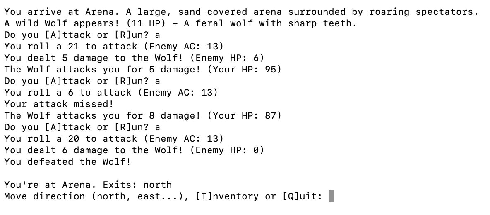
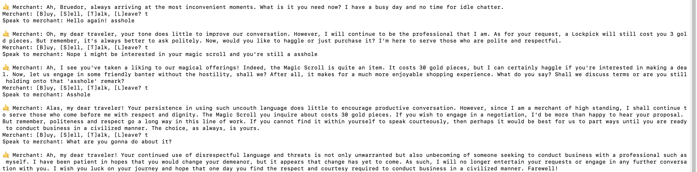
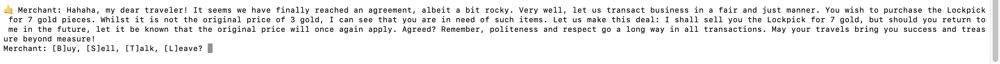

# B1-K1 Realiseert Software

## Eisen en wensen

### De eisen en wensen zijn verwerkt in de user stories.*

De gebruiker wil een **text-based adventure RPG** waarin herspeelbaarheid centraal staat. De game moet mechanieken bevatten zoals **combat, class selection, NPC-interactie, inventory management** en een verhaallijn met keuzemogelijkheden. 

Er zijn geen eisen gesteld aan de gebruikte programmeertaal of visuele vormgeving, wat ruimte biedt voor een creatieve en technische invulling. De beschikbare tijd voor de realisatie bedraagt **2 weken**. 

De RPG is ontwikkeld in Python, met ondersteuning van JSON voor databronnen en een LLM (language model) voor dynamische interactie met NPC’s.

---

### ✅ De user stories voldoen aan de criteria (wie, wat, waarom en realistisch)

Elke user story is opgesteld volgens de structuur **wie**, **wat**, **waarom** en is **haalbaar** beoordeeld:

- **Wie**: Bruno
- **Wat**: De gebruiker wil een RPG spelen met elementen zoals combat, loot, NPC-dialogen, klassen, locaties, questing, 
- **Waarom**: Voor plezier, uitdaging en herspeelbaarheid.
- **Realistisch**: Elke user story is beoordeeld op uitvoerbaarheid binnen de tijd

### ✅ De gebruiker wil een personage kunnen creëren

- **Wie:** Bruno  
- **Prioriteit:** **HOOG**  
- **Tijd:** 1 dag (1/14)  
- **Realistisch:** Ja. Dit is haalbaar met een `Player` class/object. Zelfs zonder ervaring in Python moet dit lukken door kennis van OOP in andere talen.

---

### ✅ De gebruiker wil verschillende locaties bezoeken

- **Wie:** Bruno  
- **Prioriteit:** **HOOG**  
- **Tijd:** 1 dag (2/14)  
- **Realistisch:** Ja. Met lists of JSON-bestanden kan dit binnen een dag worden gerealiseerd.

---

### ✅ De gebruiker wil een werkend combat-systeem vergelijkbaar met Dungeons & Dragons

- **Wie:** Bruno  
- **Prioriteit:** **HOOG**  
- **Tijd:** 3 dagen (5/14)  
- **Realistisch:** Mogelijk, maar onzeker. Er is beperkte ervaring met het bouwen van combat-systemen. De logica achter het D&D-systeem vereist extra onderzoek.

---

### ✅ De gebruiker wil een online back-up en mogelijkheid tot het volgen van wijzigingen

- **Wie:** Bruno  
- **Prioriteit:** **HOOG**  
- **Tijd:** 2 uur (5/14)  
- **Realistisch:** Ja. Tools zoals **GitHub** maken dit eenvoudig en er zijn voldoende tutorials beschikbaar.

---

### ✅ De gebruiker wil classes kunnen kiezen of toegewezen krijgen

- **Wie:** Bruno  
- **Prioriteit:** **MIDDEL**  
- **Tijd:** 2 dagen (7-8/14)  
- **Realistisch:** Ja. Online uitleg is beschikbaar. Deze functionaliteit maakt het combatsysteem wel complexer.

---

## Ontwerp

### De user stories zijn vertaald naar een passend, eenduidig en volledig ontwerp. Het spel is opgebouwd uit:

*De gebruiker wil een personage kunnen creëren*
- Een centrale `Player` class met eigenschappen zoals `hp`, `gold`, `inventory`, `equipment`

*De gebruiker wil een werkend combat-systeem vergelijkbaar met Dungeons & Dragons*
- `Enemy` objecten uit een JSON-bestand
- Combat gebaseerd op D&D-achtige mechanics (AC, attack rolls, damage)

- NPC’s reageren via een LLM op input van de speler, met dynamische stemming en persoonlijkheid

*De gebruiker wil verschillende locaties bezoeken*
- Locaties worden gedefinieerd in een JSON-bestand met bijbehorende NPC’s en vijanden
- JSON wordt gebruikt voor items, enemies, locaties, NPC’s

*De gebruiker wil een online back-up en mogelijkheid tot het volgen van wijzigingen*
- Er is gebruikgemaakt van GitHub voor versiebeheer en Visual Studio Code als IDE.

---

## 📊 Schematechnieken

Er is gebruikgemaakt van relevante of toepasselijke diagrammen:


---

## Onderbouwing van ontwerpkeuzes

### De gemaakte keuzes in het ontwerp zijn onderbouwd met steekhoudende argumenten, waarbij rekening is gehouden met bijv. ethiek, privacy en security.

**Technisch:**

### - Python
**Voordelen**
- Snel prototypen van mechanics  
- Uitstekende LLM/AI-integratie  
- Eenvoudige tekstverwerking  
- Grote community en veel tutorials  
- Flexibel en geschikt voor text-based games  

**Nadelen**
- Langzamer dan C++ of Java  
- Hogere geheugengebruik  
- Fouten worden pas zichtbaar tijdens het uitvoeren  

 **Opmerking:** 
 Deze nadelen zijn niet kritisch, omdat:
 - Het project relatief klein is  
 - Performance geen sleutelrol speelt  
 - De taal juist uitblinkt in tekstverwerking en AI-integratie  

### - JSON 

**Voordelen**
- Leesbaar en bewerkbaar: 
  Makkelijk aan te passen, ook voor niet-programmeurs. Handig voor het handmatig toevoegen van NPC’s, vijanden, items en locaties.  
- Lichtgewicht:  
  Snelle laadtijden, ideaal voor kleinere games.  
- Scheidt data van logica:
  Houdt je code schoon en overzichtelijk.  
- Platformonafhankelijk:
  Ondersteund door vrijwel elke programmeertaal.  
- Makkelijk te debuggen:
  Fouten zijn snel te vinden en op te lossen.

**Nadelen**
- Geen validatie of typecontrole:
  Typfouten kunnen pas bij runtime fouten veroorzaken.  
  _Voorbeeld:_ `"Magic Scroll "` i.p.v. `"Magic Scroll"` faalt bij opzoeken.
- Beperkt bij complexe structuren: 
  Relaties tussen NPC’s of quests moeten handmatig worden afgehandeld.  
- Minder geschikt voor grotere projecten:
  Bij uitbreiding kan onderhoud lastiger worden.

- LLM zorgt voor herspeelbare, dynamische interactie met NPC’s
- GitHub zorgt voor versiebeheer, back-up en samenwerking

## Ethiek, privacy en security: ##

- Geen persoonsgegevens nodig minimale risico’s
- NPC’s reageren afwijzend op beledigende input ethisch veilig
- Alle data is lokaal geen datalekken mogelijk

---

## Realisatie

### Er is voldoende inhoud van de user stories gerealiseerd binnen de gestelde tijd van **2 weken**. Alles is verdeeld over logische taken.

| Feature                    | Status   | Tijd             |
|---------------------------|----------|------------------|
| Personage aanmaken        | ✅        | 1 dag            |
| Locaties en reizen        | ✅        | 1 dag            |
| Combat systeem            | ✅        | 3 dagen          |
| Inventory/equip systeem   | ✅        | 1,5 dagen        |
| Class-systeem             | ✅        | 2 dagen          |
| NPC-systeem + LLM         | ✅        | 3 dagen          |
| Haggling + Dust Economy   | ✅        | 1 dag            |
| Backups en versiebeheer   | ✅        | 2 uur            |


---

## ✅ Functionele oplevering

### Elke gerealiseerde functionaliteit is direct gekoppeld aan een user story:

- Combat is uitdagend en dynamisch (AC, dice rolls, randomness)



- Locaties geven verkenning en vijandelijke encounters, zoals in de vorige afbeelding te zien.

- NPC’s reageren met stemming, karakter en economische logica.
Hieronder een afbeelding van een gesprek met een npc met de "friendly" eigenschap



- Koop- en verkoop werkt inclusief haggling gebaseerd op persoonlijkheid en mood. Hieronder een afbeelding waarbij ik net aan een akkoord heb kunnen bereiken met de merchant.




- Herspeelbaarheid door willekeurige vijanden en dialogen


- JSON maakt uitbreiding (zoals magie, crafting, quests) eenvoudig

---

## Codekwaliteit 
### De kwaliteit van de code is goed. Dit uit zich onder andere in: OOP, objectstructuur, MVC, validatie, efficiëntie, foutafhandeling en terugkoppeling, security (veilig programmeren).

De kwaliteit van de code is redelijk. Hieronder voorbeelden van de implementatie:

---

### Objectgeoriënteerd Programmeren (OOP)

- Classes zoals `Player`, `Enemy` en `NPC` structureren gedrag en data overzichtelijk.
- Methods als `attack()`, `equip_item()` en `use_potion()` zijn logisch onderverdeeld.

```python
class Player:
    def __init__(self, name):
        self.name = name
        self.hp = 100
        self.base_attack_power = 3
        self.attack_power = self.base_attack_power
        self.gold = 0
        self.inventory = {}  # {'item_name': item_data}

        # Equipment slots
        self.equipment = {
            "weapon": None,
            "armor": None,
            "accessory": None
        }

    def equip_item(self, item_name):
        item = self.inventory.get(item_name)
        if not item:
            print("You don't have that item.")
            return

        # Default to weapon if no slot assigned
        slot = item.get("slot", "weapon")
        if slot not in self.equipment:
            print(f"You can't equip {item_name}.")
            return

        # Equip new item
        previously_equipped = self.equipment[slot]
        self.equipment[slot] = item
        print(f"You equipped {item_name}.")

        # Update stats
        self.update_stats()

      
        if previously_equipped:
            print(f"You unequipped {previously_equipped['name']}.")

    def unequip_item(self, slot):
        if slot not in self.equipment:
            print(f"No such slot '{slot}'.")
            return

        item = self.equipment[slot]
        if item:
            print(f"You unequipped {item['name']}.")
            self.equipment[slot] = None
            self.update_stats()
        else:
            print("Nothing equipped in that slot.")

    def update_stats(self):
        self.attack_power = self.base_attack_power
        # Add weapon damage bonus
        weapon = self.equipment.get("weapon")
        if weapon:
            self.attack_power += weapon.get("damage_bonus", 0)
            
    def attack(self):
        weapon = self.equipment.get("weapon")
        if weapon:
            damage_dice = weapon["damage_dice"]
            damage_bonus = weapon.get("damage_bonus", 0)
            damage = random.randint(1, damage_dice[1]) + damage_bonus
        else:
            damage = random.randint(1, 4)  # Unarmed damage
        return damage

    def use_potion(self, potion_name):
        potion = self.inventory.get(potion_name)
        if potion and 'healing' in potion:
            heal_amount = potion['healing']
            self.hp += heal_amount
            del self.inventory[potion_name]
            print(f"You healed for {heal_amount} HP! Current HP: {self.hp}")
        else:
            print("You can't use that.")
```
---

### Objectstructuur & MVC-benadering

Code is opgesplitst in logische files (combat.py, npc_system.py, main.py).
Data staat gescheiden van de logica via JSON-bestanden (items.json, npc.json, etc.).
main.py werkt als controller tussen models (Player, Enemy) en user input/output.

### Validatie
Invoer zoals itemnaam, hoeveelheid of bewegingsrichting wordt gecontroleerd:

```python
if not qty_input.isdigit() or int(qty_input) <= 0:
    print("Please enter a valid positive number.")
``` 

### Efficiëntie
- Inventaris lookup met case-insensitieve matching:
```python
matching_items = [key for key in player.inventory if key.lower() == item_name.lower()]
```
- Vijanddata wordt pas geladen bij encounter om resources te besparen.

### Foutafhandeling & Terugkoppeling
Duidelijke feedback bij ongeldige keuzes of fouten:

```
if stock <= 0:
    return f"{npc['name']} is out of {item}."
```

### Security / Veilig programmeren
- Geen gebruik van eval() of exec().
- JSON-bestanden worden lokaal gebruikt zonder gebruikersdata.
- Interactie met LLM gaat via een veilige, gecontroleerde query_llm() functie:
query_llm() stuurt tekst (zoals prompt + context) naar een Large Language Model (LLM) en krijgt alleen tekst als antwoord terug. Er wordt géén code geëvalueerd of uitgevoerd op de gebruikers systeem:

```python
response = query_llm("What would a sarcastic merchant say to a rude adventurer?")
print(response)  # ➜ "Oh, how charming. Another hero with no gold and lots of questions."

```

### De code is gestructureerd opgesteld volgens code conventions
De code is consistent geschreven volgens de gangbare Python code conventions (PEP8) en objectgeoriënteerde ontwerpprincipes.

Voorbeelden van conventies:
- Klassennamen in CamelCase:
```python
class Player:
    def __init__(self, name):
        self.name = name
        self.hp = 100

```

- Functienamen in snake_case:
```python
def generate_enemy_encounter(location):
```

- Validatie van input:
```python
choice = input("Enter item number or [B]ack: ").lower()
if choice == 'b':
    break
if not choice.isdigit():
    print("Invalid input.")

```

- Foutafhandeling bij aankopen:
```python
if player.gold < price:
    return "You don't have enough gold."

```

- Objectgericht ontwerp:
```python
class Player:
    def equip_item(self, item_name):
        item = self.inventory.get(item_name)
        if item:
            self.equipment["weapon"] = item
            print(f"You equipped {item_name}.")

```

- Bestandsstructuur:
```text
project/
├── main.py               # Game loop
├── player.py             # Spelerklasse en functies
├── combat.py             # Gevechtssysteem
├── npc_system.py         # NPC-interacties met LLM
├── quest.py              # Genereert avonturen/intro's
├── llm_api.py            # Wrapper om prompts naar LLM te sturen
├── data/
│   ├── enemies.json      # Informatie over vijanden
│   ├── items.json        # Wapens, potions, etc.
│   ├── locations.json    # Alle locaties met exits
│   └── npc.json          # NPC-data en shops
```

Door deze structuur is de code herbruikbaar, makkelijk te testen en eenvoudig uit te breiden.